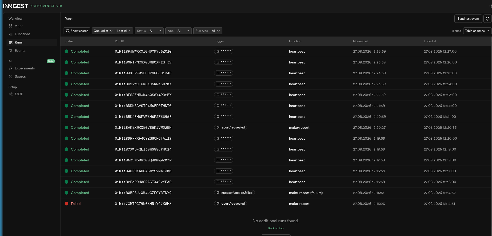

# Your first background job

FlyRank Internship · Backend Track · Week 4 · Assignment A7

Repo: https://github.com/NuriOkumus/background-job

A small API whose slow work happens in a background job: `POST /reports` answers instantly (202), a status endpoint reports progress, and a cron job runs on the clock, alone.

Lane: **JavaScript (Node.js + Express + Inngest)**.

## How to run it (two terminals)

**Terminal 1 — the API**

```bash
npm install
INNGEST_DEV=1 npm start
```

Runs on `http://localhost:3000`.

**Terminal 2 — the Inngest Dev Server**

```bash
npm run dev:inngest
```

Dashboard at `http://localhost:8288`.

## Endpoints & functions

| Endpoint / Function | What it does |
|---|---|
| `GET /health` | Liveness check → `{"status":"ok"}` |
| `POST /reports` | Accepts `{"topic": "..."}`, returns **202** + `{id, status:"pending"}` in well under a second. `400` if `topic` is missing. |
| `GET /reports/:id` | Returns the report: `pending` → `done` + result, or `failed`. `404` for unknown id. |
| `say-hello` (Inngest fn) | Triggered by `test/hello`, sleeps 5s, returns a greeting. First wiring check. |
| `make-report` (Inngest fn) | Triggered by `report/requested`. Sleeps 8s (stand-in for slow work), then builds the report. Topic `"fail"` throws on purpose to demonstrate retries (`retries: 2` → 3 attempts, then `Failed`, status set to `"failed"`). |
| `heartbeat` (Inngest fn) | Cron `* * * * *` (every minute). Logs a one-line summary of pending/done/failed report counts. No endpoint, no event — the clock is the only trigger. |

## Proof: 202 then poll

```
$ curl -s -i -X POST http://localhost:3000/reports -H "Content-Type: application/json" -d '{"topic":"cats"}'
HTTP/1.1 202 Accepted
{"id":"87039cc8-2604-4d72-abfc-b323d1cf2c69","status":"pending"}

$ curl -s http://localhost:3000/reports/87039cc8-2604-4d72-abfc-b323d1cf2c69
{"id":"87039cc8-2604-4d72-abfc-b323d1cf2c69","status":"pending"}

# ~9s later
$ curl -s http://localhost:3000/reports/87039cc8-2604-4d72-abfc-b323d1cf2c69
{"id":"87039cc8-2604-4d72-abfc-b323d1cf2c69","topic":"cats","status":"done","result":{"summary":"Report for \"cats\" generated at 2026-08-27T09:11:55.203Z"}}
```

The `POST` answered in ~15ms even though the underlying work takes 8 seconds — the request is fast, the work is slow, and the client polls to find out when it's done. That's the pattern behind every "we'll email you when it's ready."

## Stage 3 note (retries vs. validation)

A **retry** re-runs a job that failed *at the wrong moment* (a flaky network call, a transient service hiccup) — the input was fine, so trying again later can succeed. **Validation** rejects a request that was *wrong from the start* (a missing `topic`) with an immediate `400`; retrying a bad request would just fail the same way three more times, so it's rejected at the door instead of being queued as a job.

## Stage 4 note (cron expressions)

- Every day at 08:00: `0 8 * * *`
- Every Sunday at 22:00: `0 22 * * 0`

(Built and verified on crontab.guru. The `heartbeat` function itself runs `* * * * *` — every minute — for easy testing.)

## Dashboard

Runs view (`localhost:8288/runs`) — a completed `make-report`, a failed `make-report` (plus its `make-report (failure)` handler), and repeated `heartbeat` cron runs one minute apart:



## AI vs me

_(Stage 6, bonus — not attempted in this submission.)_
